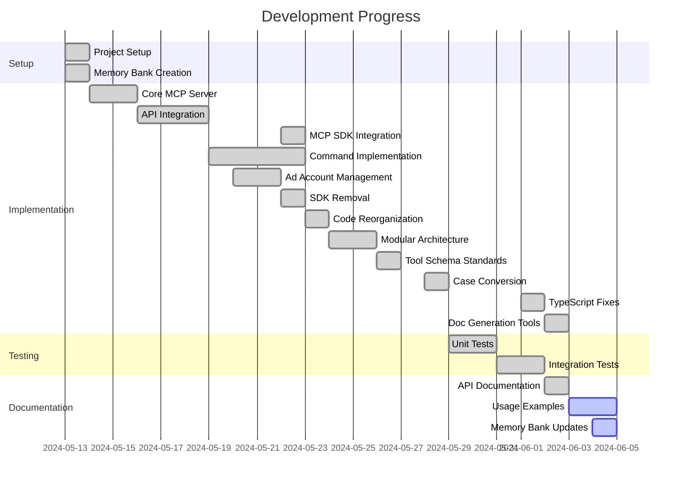

# Active Development Context

## Current Focus

We are enhancing the project's documentation and code quality, having recently implemented comprehensive documentation generation tools and fixed TypeScript issues that were affecting the build process.

### Recent Implementation: Documentation Generation System

We've added a robust documentation generation system that automatically creates documentation from TypeScript types:

```typescript
// Documentation generator in src/utils/docgen.ts
export function generateToolFromType(
  name: string,
  description: string,
  configType: string,
  additionalParams: Record<string, any> = {}
): Tool {
  const inputSchema: any = {
    type: "object",
    properties: {
      ...additionalParams
    },
    required: []
  };
  
  // Add config parameter if it's a config type
  if (configType.includes('Config')) {
    inputSchema.properties.config = {
      type: "object",
      description: `${configType.replace('Config', '')} configuration object`
    };
    inputSchema.required.push('config');
  }
  
  // ... more logic to build tool definitions
  
  return {
    name,
    description,
    inputSchema
  };
}
```

This implementation:
1. Generates standardized tool definitions from TypeScript types
2. Creates documentation in both JSON and Markdown formats
3. Ensures documentation stays in sync with code changes
4. Organizes tools by entity type (campaigns, ad sets, ads, accounts)
5. Generates example code snippets for each tool

### TypeScript Fixes

We've resolved TypeScript typing issues that were preventing the build process from completing:

1. Fixed type issues in `src/types/response/assets.ts` by:
   - Adding proper type definitions for functions and interfaces
   - Fixing the typing of params and return values
   - Ensuring consistency between function implementations and declarations

2. Fixed type issues in `src/operations/ad.ts` by:
   - Properly annotating required properties and interfaces
   - Adding type assertions for problematic object accesses

These changes have improved the codebase stability and maintainability.

### Documentation System

We've implemented a two-stage documentation generation process:

1. **JSON Generation**: `generate-docs` script that outputs tool definitions in JSON format
2. **Markdown Conversion**: `generate-markdown-docs` script that converts JSON to readable Markdown
3. **Combined Command**: `npm run docs` that runs both steps in sequence

Key files created:
- `src/scripts/generate-docs.ts` - JSON documentation generator
- `src/scripts/generate-markdown-docs.ts` - Markdown documentation generator
- Updated `package.json` with new documentation commands

## Development Status


## Priority Tasks

1. **Create additional usage examples for the documentation**
2. **Add more comprehensive parameter documentation to tool schemas**
3. **Implement remaining analytics and reporting tools**
4. **Enhance error handling for edge cases**
5. **Improve test coverage for new documentation generators**
6. Implement custom audience management tools
7. Add performance optimization for large-scale operations
8. Create specialized tools for ad creative management
9. Add validation for industry-specific ad requirements
10. Implement advanced targeting options

## Open Questions

1. Should we implement additional documentation formats beyond JSON and Markdown?
2. Are there additional sections needed in the generated documentation?
3. How should we handle versioning of documentation when API changes?
4. What level of documentation detail is optimal for MCP tools?
5. Should we automate synchronization between package.json MCP exports and generated documentation?
6. Are there additional validation checks needed for the documentation generation process?
7. How should we handle documentation for deprecated APIs or features?
8. What is the best strategy for implementing analytics and reporting tools?
9. How should we approach rate limiting protection for API requests?