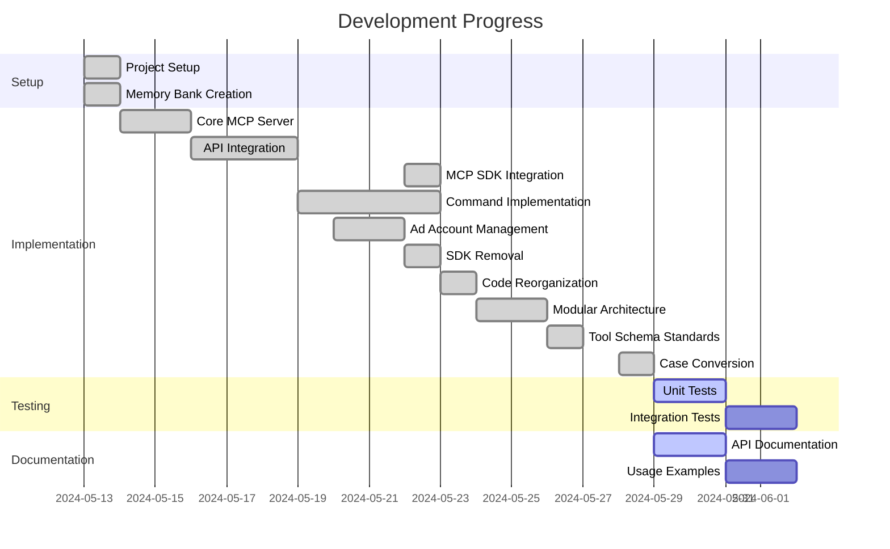

# Active Development Context

## Current Focus

We are working on stabilizing and enhancing the Facebook Marketing API integration, focused on reliable case conversion for API compatibility. We've implemented the humps library to handle camelCase to snake_case transformation consistently across all operation modules.

### Recent Implementation: Case Conversion Pattern

We've added the humps library to standardize case conversion between our client interface (camelCase) and the Facebook API requirements (snake_case):

```typescript
// Before (manual conversion for each property)
if (targeting.geoLocations) {
  targetingObj.geo_locations = {};
  
  if (targeting.geoLocations.countries) {
    targetingObj.geo_locations.countries = targeting.geoLocations.countries;
  }
  // ... and many more manual conversions
}

// After (using humps library)
if (targeting) {
  // Convert all keys from camelCase to snake_case properly handling nested objects
  const targetingObj = humps.decamelizeKeys(targeting);
  
  // Properly stringify the targeting object
  params.targeting = JSON.stringify(targetingObj);
}
```

This implementation:
1. Enables consistent case conversion across all operations
2. Simplifies code by removing verbose manual conversion
3. Handles complex nested objects and arrays automatically
4. Maintains type safety throughout the conversion process
5. Provides clear documentation on required formats

Key files updated:
- src/operations/adset.ts
- src/operations/ad.ts 
- src/operations/campaign.ts
- Added file header documentation about camelCase requirements

### Targeted API Schema Standards

We maintain strict schema definitions for our API operations:

1. **Naming Conventions**
   - All tool names in camelCase, starting with verb (create, update, get)
   - Consistent field names across related operations
   - Clear, descriptive parameter names
   - Input parameters in camelCase format (now enforced across all modules)

2. **Documentation Style**
   - Comprehensive descriptions for each parameter
   - Examples where appropriate
   - Detailed type information

3. **Nested Object Structure**
   - Fully document nested objects with all available properties
   - Structure complex objects with proper indentation for readability
   - Follow camelCase convention for all property names

4. **Parameter Organization**
   - Group related parameters together in the schema
   - Order parameters from most essential to most specialized
   - Required parameters should be listed first when possible

5. **Schema Validation**
   - Use `required` arrays to specify mandatory fields
   - Add validation properties appropriate to the field type
   - Include pattern constraints where applicable

These standards ensure our tool schemas are both human-readable and machine-processable, providing clear guidance to developers and AI assistants using our MCP tools.

## Development Status


## Priority Tasks

1. **Update unit tests to verify case conversion functionality**
2. **Add integration tests for case conversion edge cases**
3. **Update all remaining tool schemas to follow the new standards**
4. **Update API documentation to clarify camelCase requirements**
5. Verify Cursor integration working with MCP SDK
6. Test all tools through Cursor interface
7. Complete ad account management functions
8. Implement remaining MCP exports
9. Create usage examples with proper camelCase format
10. Add comprehensive error handling

## Open Questions

1. What additional Tool schema requirements might be needed for best Cursor compatibility?
2. Are there SDK-specific error patterns we should be following?
3. Additional business account management features needed?
4. Performance considerations for larger ad account lists?
5. Additional MCP tools to integrate?
6. Best practices for credential management?
7. Additional error handling requirements?
8. Any advantages to using specialized API libraries in the future?
9. Should we add automatic conversion from snake_case to camelCase for incoming requests?