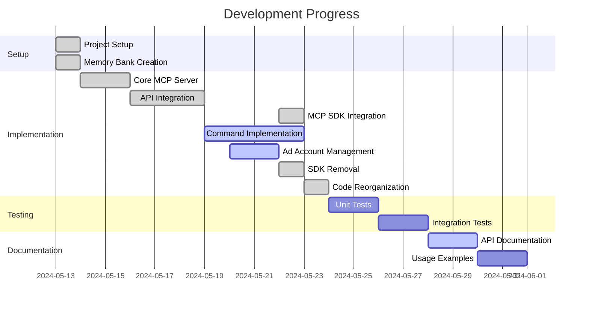

# Active Development Context

## Current Focus

We are currently focused on integrating and optimizing the Model Context Protocol (MCP) SDK within our Facebook Marketing API integration. This involves:

1. Standardizing our tool definitions using the official MCP SDK package
2. Refactoring server implementation to use SDK interfaces and utilities
3. Enhancing input validation using JSON Schema standards
4. Implementing proper error handling according to MCP specifications
5. Testing tool execution through the MCP protocol
6. Ad account discovery and management functionality
7. Optimizing environment variable requirements
8. Direct Graph API integration
9. **Codebase organization improvements**

## Recent Changes

- Integrated the official `@modelcontextprotocol/sdk` package (version ^0.3.0)
- Refactored server implementation to comply with SDK interfaces
- Updated tool definitions to use standardized MCP format
- Enhanced input validation using SDK's JSON Schema utilities
- Implemented error handling with proper MCP error formats
- Updated documentation to reflect SDK integration
- Restructured code to separate core logic from MCP-specific implementations
- **Moved all utility scripts to a dedicated `src/scripts` directory for better organization**
- **Updated import paths in script files to maintain functionality**
- **Updated npm script paths in package.json**
- Made FB_APP_ID and FB_APP_SECRET optional when using MCP tools
- Added functionality to list all available ad accounts
- Implemented getAvailableAdAccounts method
- Added a command-line tool to list available ad accounts
- Created MCP utility functions for better ad account management
- Added package.json exports for additional ad account retrieval methods
- Updated Facebook Graph API version from v18.0 to v22.0 to use the latest available version
- Updated all API endpoint URLs to use v22.0
- Removed facebook-nodejs-business-sdk dependency
- Implemented direct Graph API calls using fetch API
- Created custom type definitions to replace SDK types
- Removed all SDK imports from the codebase
- Updated all methods to use direct Graph API calls
- Simplified code by removing SDK-specific abstractions

## Next Steps

1. **Complete Test Suite**:
   - Add unit tests for SDK integration
   - Test edge cases in error handling
   - Ensure compatibility with latest SDK version
   - Test the MCP SDK integration thoroughly with Cursor

2. **Implementation**:
   - Implement the two additional ad account methods:
     - getOwnedAdAccounts
     - getClientAdAccounts
   - Verify all tool functionality is properly mapped via SDK
   - Enhance error handling for ad account listing
   - Add type definitions for ad account response objects
   - Implement additional MCP tools integration
   - Finalize removal of any remaining SDK references

3. **Performance Optimization**:
   - Identify bottlenecks in request handling
   - Optimize tool execution flow
   - Implement caching where appropriate
   - Performance optimizations for direct API calls

4. **Documentation Updates**:
   - Add examples of tool definitions using SDK
   - Create usage guide for integrating with LLM services
   - Document error handling patterns
   - Update the README with SDK integration details
   - Expand documentation with ad account management examples

5. **User Experience Improvements**:
   - Better error messages and feedback
   - Simplified configuration process
   - Enhanced logging and debugging

## Active Decisions

1. **SDK Integration Approach**:
   - Fully adopt the official MCP SDK rather than maintaining our own implementation
   - Ensure compatibility with future MCP protocol changes
   - Reduce maintenance burden of our own implementation
   - Leverage standardized interfaces and utilities
   - Simplify integration with LLM providers that support MCP
   - Standardizing input/output formats via SDK interfaces

2. **Error Handling Strategy**:
   - Categorizing errors into API errors, validation errors, and system errors
   - Using structured error responses following MCP specifications
   - Including context-specific details to aid debugging
   - Maintaining consistent error formats across all tools
   - Improved error handling with SDK error patterns

3. **Schema Validation**:
   - Using JSON Schema for input validation as it aligns with MCP protocol standards
   - Leveraging SDK's utilities for schema validation
   - Offering clear, structured validation errors
   - Self-documenting API specifications

4. **API Integration**:
   - Making some environment variables optional to simplify setup
   - Using TypeScript for type safety
   - Implementing ad account discovery features
   - Using MCP tools for enhanced functionality
   - Storing minimal required credentials
   - Using direct Graph API calls instead of SDK dependency
   - Implementing custom type definitions for Facebook objects

5. **Code Organization**:
   - Moving utility scripts to a dedicated `src/scripts` directory
   - Maintaining clear separation between core functionality and utilities
   - Using relative imports to maintain code relationships
   - Improved discoverability of utility scripts
   - Better structure for adding new utility scripts in the future

## Current Challenges

1. **SDK Version Compatibility**:
   - Ensuring compatibility with future SDK updates
   - Managing potential breaking changes

2. **Performance Considerations**:
   - Overhead introduced by schema validation
   - Response time impact of additional layers
   - Performance impact of MCP SDK integration

3. **Integration Testing**:
   - Testing with actual LLM providers
   - Simulating real-world usage patterns
   - Additional tool specifications required by Cursor

4. **Documentation Completeness**:
   - Keeping documentation in sync with SDK changes
   - Providing clear migration guides for users
   - Enhanced documentation for ad account discovery

5. **Feature Development**:
   - Additional ad account management features
   - Business account integration
   - Improved error handling for API rate limits
   - Additional MCP tool integrations

## Key Insights

- The MCP SDK simplifies tool definition but requires careful attention to schema structure
- Error handling becomes more standardized but requires additional context for debugging
- The protocol establishes clear boundaries between the LLM and our service
- The standardized approach improves compatibility but may limit customization
- Direct Graph API calls provide more control and remove dependency overhead
- **Organizing scripts into a dedicated directory improves codebase maintainability**

## Recent Discussions

- Whether to maintain backward compatibility with pre-SDK implementations
- How to structure error responses for maximum utility to LLM consumers
- Performance implications of additional validation layers
- Best practices for versioning our MCP tools
- Additional business account management features needed
- Performance considerations for larger ad account lists
- Best practices for credential management
- **Project structure and organization improvements**

## Development Status

## Priority Tasks

1. **Verify Cursor integration working with MCP SDK**
2. **Test all tools through Cursor interface**
3. Complete ad account management functions
4. Implement remaining MCP exports
5. Update documentation with new features
6. Add comprehensive error handling
7. Create usage examples for ad account discovery
8. Finalize removal of any remaining SDK references

## Open Questions

1. What additional Tool schema requirements might be needed for best Cursor compatibility?
2. Are there SDK-specific error patterns we should be following?
3. Additional business account management features needed?
4. Performance considerations for larger ad account lists?
5. Additional MCP tools to integrate?
6. Best practices for credential management?
7. Additional error handling requirements?
8. Any advantages to using specialized API libraries in the future? 