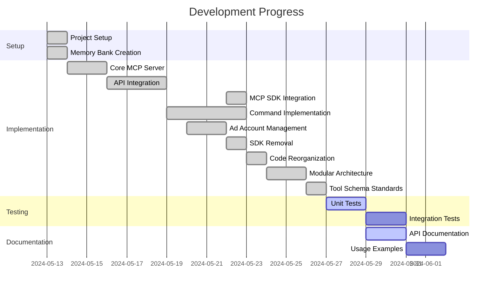

# Active Development Context

## Current Focus

We are currently focused on integrating and optimizing the Model Context Protocol (MCP) SDK within our Facebook Marketing API integration. This involves:

1. Standardizing our tool definitions using the official MCP SDK package
2. Refactoring server implementation to use SDK interfaces and utilities
3. Enhancing input validation using JSON Schema standards
4. Implementing proper error handling according to MCP specifications
5. Testing tool execution through the MCP protocol
6. Ad account discovery and management functionality
7. Optimizing environment variable requirements
8. Direct Graph API integration
9. **✓ Codebase organization improvements** (completed modular refactoring)
10. **Code maintainability through module size constraints**

We're implementing a comprehensive Facebook Marketing API integration to automate ad creation, management, and analytics processes. The implementation will follow a phased approach to deliver incremental value while building toward a complete solution.

## Recent Major Refactoring
We've completed a significant refactoring of the codebase to improve maintainability and adhere to clean code principles:

1. **Modular Architecture Implementation**
   - Split monolithic client.ts (1179 lines) into smaller modules
   - Broke down server.ts into smaller, focused files
   - Created operations/ directory for domain-specific modules
   - Created utils/ directory for shared utilities
   - Each module now under 300 lines for maintainability

2. **Server Component Modularization**
   - Extracted tool definitions into dedicated tools.ts file
   - Moved request handlers to handlers.ts
   - Extracted configuration and logging to config.ts
   - Simplified server.ts to focus on server setup and initialization
   - Improved separation of concerns across all server components

3. **Code Organization Improvements**
   - Extracted API utilities into utils/api.ts
   - Separated operations by domain:
     - Campaign operations (operations/campaign.ts)
     - Ad Set operations (operations/adset.ts)
     - Ad operations (operations/ad.ts)
     - Account operations (operations/account.ts)
   - Client.ts now uses facade pattern to delegate to specific modules

4. **Consistency Improvements**
   - Standardized function signatures across modules
   - Consistent parameter ordering (baseUrl, adAccountId, accessToken, etc.)
   - Centralized error handling in API utilities
   - Improved module imports and exports

## Facebook Marketing API Delivery Roadmap (MVP Scope)

### Phase 1: Core Campaign Management (Weeks 1-2)
- [x] Basic client setup with authentication
- [x] Campaign CRUD operations
- [x] Ad Set CRUD operations
- [x] Ad CRUD operations
- [x] Modular code organization
- [ ] Error handling and logging improvements
- [ ] Add stronger validation for ad content and targeting

### Phase 2: Enhanced Targeting & Creative Management (Weeks 3-4)
- [ ] Custom audience creation and management
- [ ] Lookalike audience generation
- [ ] Specialized targeting options
- [ ] Enhanced creative management
  - [ ] Image and video creative uploads
  - [ ] Dynamic creative options
  - [ ] Creative performance testing framework
- [ ] Ad template system for common business verticals

### Phase 3: Analytics & Insights Integration (Weeks 5-6)
- [ ] Campaign performance reporting
- [ ] Ad set insights
- [ ] Ad-level analytics
- [ ] ROI calculation
- [ ] Conversion tracking implementation
- [ ] Custom metrics (cost per lead, cost per acquisition, etc.)

### Phase 4: Automation & Optimization (Weeks 7-8)
- [ ] Automated budget allocation
- [ ] A/B testing framework for ads
- [ ] Scheduling system for seasonal promotions
- [ ] Automated bid management
- [ ] Performance-based campaign adjustments
- [ ] Keyword optimization

### Phase 5: Compliance & Special Features (Weeks 9-10)
- [ ] Special ad category compliance for regulated industries
- [ ] Lead generation form implementation
- [ ] Compliant lead handling
- [ ] Testimonial management system
- [ ] Before/after image management (with Facebook policy compliance)
- [ ] Age and demographic targeting compliance

### Phase 6: Integration & Dashboard (Weeks 11-12)
- [ ] Integration with business management software
- [ ] Custom dashboard for managers
- [ ] ROI visualization tools
- [ ] Business-specific campaign templates
- [ ] Automated reporting system
- [ ] Multi-location support

## API Implementation Priority

### Critical APIs for Initial Implementation
1. Campaign Management APIs
   - `POST /act_{ad_account_id}/campaigns` (Create campaigns)
   - `GET /act_{ad_account_id}/campaigns` (List campaigns)
   - `POST /{campaign_id}` (Update campaigns)

2. Ad Set Management APIs
   - `POST /act_{ad_account_id}/adsets` (Create ad sets)
   - `GET /act_{ad_account_id}/adsets` (List ad sets)
   - `POST /{adset_id}` (Update ad sets)

3. Ad Management APIs
   - `POST /act_{ad_account_id}/ads` (Create ads)
   - `GET /act_{ad_account_id}/ads` (List ads)
   - `POST /{ad_id}` (Update ads)

### Secondary Priority APIs
1. Creative Management
   - `POST /act_{ad_account_id}/adcreatives` (Create creative)
   - `GET /act_{ad_account_id}/adcreatives` (List creatives)

2. Insights & Analytics
   - `GET /{campaign_id}/insights` (Campaign insights)
   - `GET /{adset_id}/insights` (Ad set insights)
   - `GET /{ad_id}/insights` (Ad insights)

3. Audience Management
   - `POST /act_{ad_account_id}/customaudiences` (Custom audiences)
   - `POST /act_{ad_account_id}/lookalikaudiences` (Lookalike audiences)

### Specialized APIs
1. Lead Generation
   - `POST /act_{ad_account_id}/leadgen_forms` (Create lead forms)
   - `GET /{form_id}/leads` (Get form submissions)

2. Targeting & Compliance
   - `GET /act_{ad_account_id}/targetingvalidation` (Validate targeting)
   - Special Ad Category compliance endpoints

## Recent Changes
- Completed major code refactoring to implement modular architecture
- Implemented facade pattern for client.ts to improve maintainability
- Extracted API utilities into separate module for reuse
- Created domain-specific operation modules for campaigns, ad sets, ads, and accounts
- Updated all imports and exports to reflect new structure
- Enhanced documentation with new architecture details

## Next Steps
1. Update unit tests to work with new modular structure
2. Add integration tests for new module boundaries
3. Implement enhanced reporting and analytics features
4. Build custom audience management for targeted advertising
5. Develop ad creative templates for various use cases
6. Create lead management system for conversion optimization

## Active Decisions

1. **SDK Integration Approach**:
   - Fully adopt the official MCP SDK rather than maintaining our own implementation
   - Ensure compatibility with future MCP protocol changes
   - Reduce maintenance burden of our own implementation
   - Leverage standardized interfaces and utilities
   - Simplify integration with LLM providers that support MCP
   - Standardizing input/output formats via SDK interfaces

2. **API Documentation and Specifications**:
   - The `/docs` folder contains the canonical reference for API specifications
   - AI assistants MUST consult the `/docs` folder for current API specifications
   - Each API entity (Ad Account, Campaign, Ad Set, Ad) has its own documentation file
   - Documentation links to official Facebook Marketing API references
   - Documentation provides specific guidance for AI implementation
   - Changes to API implementations must be reflected in corresponding documentation

3. **Error Handling Strategy**:
   - Categorizing errors into API errors, validation errors, and system errors
   - Using structured error responses following MCP specifications
   - Including context-specific details to aid debugging
   - Maintaining consistent error formats across all tools
   - Improved error handling with SDK error patterns
   - Centralized error handling in utils/api.ts module

4. **Schema Validation**:
   - Using JSON Schema for input validation as it aligns with MCP protocol standards
   - Leveraging SDK's utilities for schema validation
   - Offering clear, structured validation errors
   - Self-documenting API specifications

5. **API Integration**:
   - Making some environment variables optional to simplify setup
   - Using TypeScript for type safety
   - Implementing ad account discovery features
   - Using MCP tools for enhanced functionality
   - Storing minimal required credentials
   - Using direct Graph API calls instead of SDK dependency
   - Implementing custom type definitions for Facebook objects

6. **Code Organization**:
   - Implementing modular architecture with domain-specific modules
   - Using facade pattern in client.ts for simplified API
   - Moving utility scripts to a dedicated `src/scripts` directory
   - Maintaining clear separation between core functionality and utilities
   - Using relative imports to maintain code relationships
   - Improved discoverability of utility scripts
   - Better structure for adding new utility scripts in the future
   - Enforcing module size constraints (under 300 lines) for maintainability

## Current Challenges

1. **SDK Version Compatibility**:
   - Ensuring compatibility with future SDK updates
   - Managing potential breaking changes

2. **Performance Considerations**:
   - Overhead introduced by schema validation
   - Response time impact of additional layers
   - Performance impact of MCP SDK integration

3. **Integration Testing**:
   - Testing with actual LLM providers
   - Simulating real-world usage patterns
   - Additional tool specifications required by Cursor
   - Testing across module boundaries after refactoring

4. **Documentation Completeness**:
   - Keeping documentation in sync with SDK changes
   - Providing clear migration guides for users
   - Enhanced documentation for ad account discovery
   - Updating documentation to reflect new modular architecture

5. **Feature Development**:
   - Additional ad account management features
   - Business account integration
   - Improved error handling for API rate limits
   - Additional MCP tool integrations

## Key Insights

- The MCP SDK simplifies tool definition but requires careful attention to schema structure
- Error handling becomes more standardized but requires additional context for debugging
- The protocol establishes clear boundaries between the LLM and our service
- The standardized approach improves compatibility but may limit customization
- Direct Graph API calls provide more control and remove dependency overhead
- **Modular architecture significantly improves maintainability and testability**
- **Facade pattern simplifies client API while allowing detailed implementation in modules**

## Recent Discussions

- Whether to maintain backward compatibility with pre-SDK implementations
- How to structure error responses for maximum utility to LLM consumers
- Performance implications of additional validation layers
- Best practices for versioning our MCP tools
- Additional business account management features needed
- Performance considerations for larger ad account lists
- Best practices for credential management
- **Modular architecture implementation and benefits**
- **Code organization strategies for maintainability**
- **Tool schema standardization for better AI integration**

## MCP Tool Schema Standards

We've established the following standards for MCP tool schemas:

1. **Comprehensive Documentation**
   - Each parameter must have a clear, detailed description
   - Include examples in descriptions where helpful (e.g., "format: '23843xxxxxxxx'")
   - Explain relationships between parameters (e.g., "Alternative to dailyBudget - don't use both")
   - Add usage guidance in descriptions where appropriate

2. **Complete Type Information**
   - Use proper JSON Schema types for all parameters
   - Include `enum` arrays for parameters with fixed value sets
   - Specify `minimum` and `maximum` values where applicable
   - Add `default` values where they exist

3. **Nested Object Structure**
   - Fully document nested objects with all available properties
   - Structure complex objects with proper indentation for readability
   - Follow camelCase convention for all property names

4. **Parameter Organization**
   - Group related parameters together in the schema
   - Order parameters from most essential to most specialized
   - Required parameters should be listed first when possible

5. **Schema Validation**
   - Use `required` arrays to specify mandatory fields
   - Add validation properties appropriate to the field type
   - Include pattern constraints where applicable

These standards ensure our tool schemas are both human-readable and machine-processable, providing clear guidance to developers and AI assistants using our MCP tools.

## Development Status

## Priority Tasks

1. **Update unit tests for new modular structure**
2. **Verify all modules work correctly with integration tests**
3. **Update all remaining tool schemas to follow the new standards**
4. Verify Cursor integration working with MCP SDK
5. Test all tools through Cursor interface
6. Complete ad account management functions
7. Implement remaining MCP exports
8. Update documentation with new features
9. Add comprehensive error handling
10. Create usage examples for ad account discovery
11. Finalize removal of any remaining SDK references

## Open Questions

1. What additional Tool schema requirements might be needed for best Cursor compatibility?
2. Are there SDK-specific error patterns we should be following?
3. Additional business account management features needed?
4. Performance considerations for larger ad account lists?
5. Additional MCP tools to integrate?
6. Best practices for credential management?
7. Additional error handling requirements?
8. Any advantages to using specialized API libraries in the future?