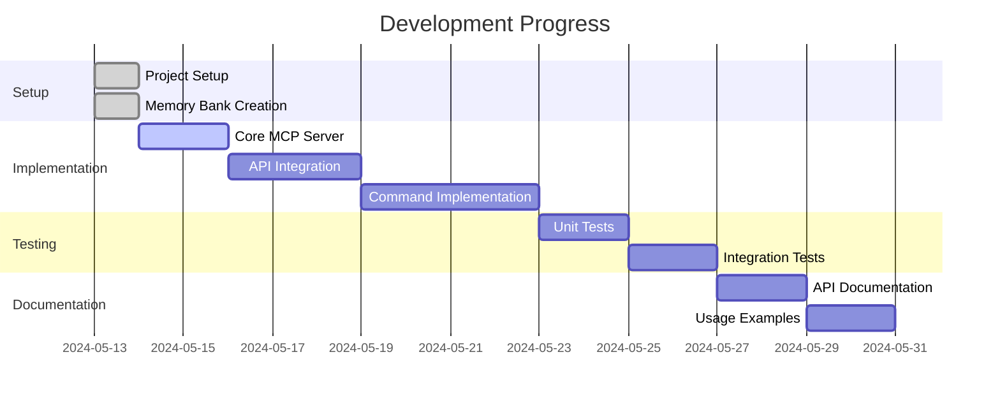

# Facebook Marketing MCP Server - Active Context

## Current Work Focus
1. Core MCP server implementation
2. Facebook Marketing API integration
3. Development environment setup
4. Testing framework setup
5. Documentation development

## Recent Changes
1. Created project structure
2. Set up TypeScript configuration
3. Implemented basic MCP server framework
4. Added Facebook Marketing API dependencies
5. Created comprehensive memory bank documentation

## Next Steps
1. Implement core MCP commands:
   - createCampaign
   - createAdSet
   - createAd
   - getAdSets
   - getAds
   - pauseCampaign
   - pauseAdSet
   - pauseAd

2. Set up testing environment
3. Implement error handling
4. Add comprehensive API documentation
5. Create example usage scenarios

## Active Decisions
1. Using TypeScript for type safety
2. Implementing modular architecture
3. Following MCP framework guidelines
4. Using environment variables for configuration
5. Implementing comprehensive error handling

## Current Considerations
1. API rate limiting implementation
2. Error handling strategy
3. Testing approach
4. Documentation structure
5. Security measures

## Development Status

## Priority Tasks
1. Complete core MCP server implementation
2. Implement Facebook Marketing API integration
3. Set up testing environment
4. Create comprehensive documentation
5. Implement error handling

## Open Questions
1. Specific error handling requirements
2. Testing strategy details
3. Documentation format preferences
4. Additional MCP commands needed
5. Performance optimization requirements 