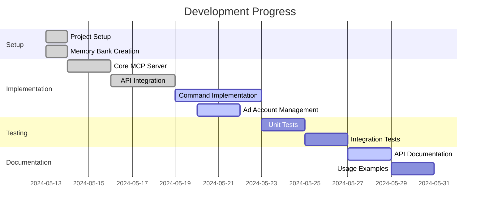

# Facebook Marketing MCP Server - Active Context

## Current Work Focus
1. Ad account discovery and management functionality
2. Optimizing environment variable requirements
3. MCP tools integration
4. Facebook Marketing API integration
5. Documentation updates

## Recent Changes
1. Made FB_APP_ID and FB_APP_SECRET optional when using MCP tools
2. Added functionality to list all available ad accounts
3. Implemented getAvailableAdAccounts method
4. Added a command-line tool to list available ad accounts
5. Created MCP utility functions for better ad account management
6. Added package.json exports for additional ad account retrieval methods

## Next Steps
1. Implement the two additional ad account methods:
   - getOwnedAdAccounts
   - getClientAdAccounts
2. Enhance error handling for ad account listing
3. Add type definitions for ad account response objects
4. Expand documentation with ad account management examples
5. Implement additional MCP tools integration

## Active Decisions
1. Making some environment variables optional to simplify setup
2. Using TypeScript for type safety
3. Implementing ad account discovery features
4. Using MCP tools for enhanced functionality
5. Storing minimal required credentials

## Current Considerations
1. Additional ad account management features
2. Business account integration
3. Improved error handling for API rate limits
4. Enhanced documentation for ad account discovery
5. Additional MCP tool integrations

## Development Status

## Priority Tasks
1. Complete ad account management functions
2. Implement remaining MCP exports
3. Update documentation with new features
4. Add comprehensive error handling
5. Create usage examples for ad account discovery

## Open Questions
1. Additional business account management features needed?
2. Performance considerations for larger ad account lists?
3. Additional MCP tools to integrate?
4. Best practices for credential management?
5. Additional error handling requirements? 