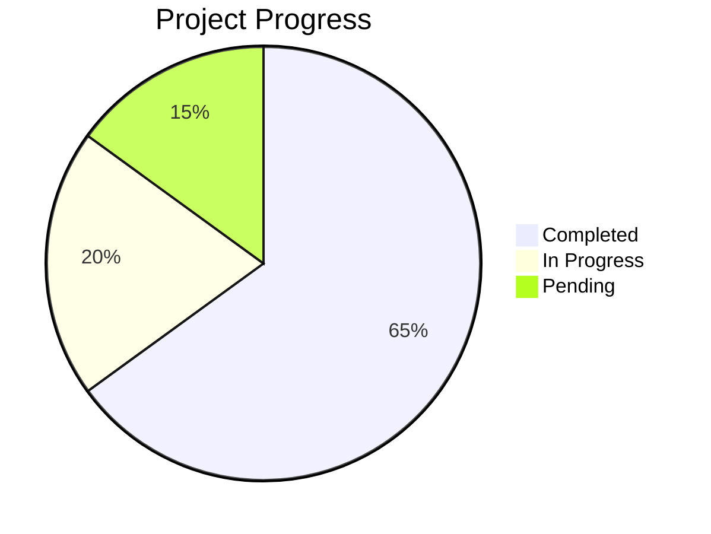

# Facebook Marketing MCP Server - Progress

## What Works
1. Project structure and configuration
2. Core Facebook Marketing API integration
3. Basic MCP server implementation
4. Campaign, AdSet, and Ad management operations
5. Environment variable configuration
6. Ad account discovery functionality
7. Optional environment variables for simplified setup
8. Command-line tool for listing ad accounts

## What's Left to Build
1. Additional Ad Account Management
   - [x] getAvailableAdAccounts
   - [ ] getOwnedAdAccounts
   - [ ] getClientAdAccounts

2. Core MCP Commands
   - [x] createCampaign
   - [x] createAdSet
   - [x] createAd
   - [x] getAdSets
   - [x] getAds
   - [x] pauseCampaign
   - [x] pauseAdSet
   - [x] pauseAd

3. Testing Infrastructure
   - [ ] Unit tests
   - [ ] Integration tests
   - [ ] Mock testing setup
   - [ ] Performance tests

4. Documentation
   - [x] Memory bank documentation
   - [x] Basic API documentation
   - [ ] Enhanced MCP tools documentation
   - [x] Configuration guide
   - [ ] Troubleshooting guide

5. Error Handling
   - [x] Basic error categorization
   - [x] Standard error messages
   - [ ] Enhanced error logging
   - [ ] Recovery procedures

## Current Status

## Known Issues
1. Type definition missing for some API responses
2. Enhanced error handling needed for ad account listing

## Recent Updates
1. Made FB_APP_ID and FB_APP_SECRET optional
2. Implemented getAvailableAdAccounts method
3. Added command-line tool for listing ad accounts
4. Updated package.json with new exports
5. Created MCP utilities for account management
6. Updated documentation for simplified setup

## Next Milestones
1. Complete additional ad account management methods
2. Enhance error handling and type definitions
3. Create documentation for ad account discovery
4. Implement remaining MCP exports
5. Add comprehensive usage examples

## Testing Status
- Unit Tests: Basic tests implemented
- Integration Tests: Planned
- End-to-End Tests: Planned
- Performance Tests: Not started

## Documentation Status
- Memory Bank Documentation: Updated
- API Documentation: In progress
- Usage Examples: Basic examples added
- Configuration Guide: Updated with optional vars
- Ad Account Management Guide: In progress

## Deployment Status
- Development: Active
- Testing: Planned
- Production: Planned 