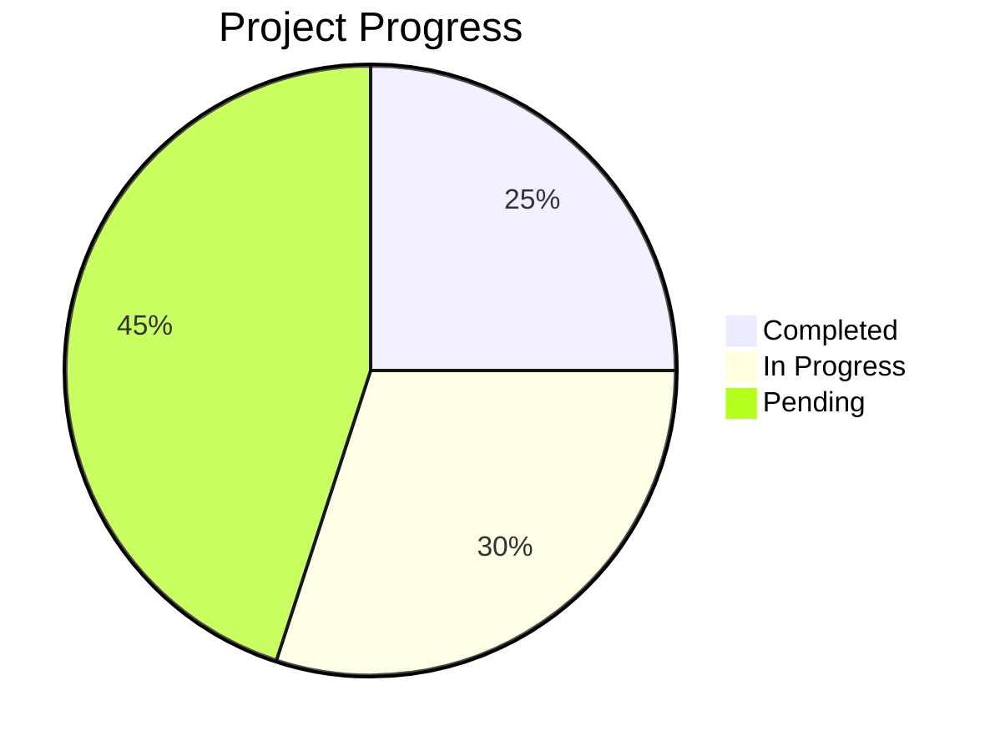

# Facebook Marketing MCP Server - Progress

## What Works
1. Project structure setup
2. TypeScript configuration
3. Basic MCP server framework
4. Dependencies installation
5. Initial documentation
6. Memory bank documentation complete

## What's Left to Build
1. Core MCP Commands
   - [ ] createCampaign
   - [ ] createAdSet
   - [ ] createAd
   - [ ] getAdSets
   - [ ] getAds
   - [ ] pauseCampaign
   - [ ] pauseAdSet
   - [ ] pauseAd

2. Testing Infrastructure
   - [ ] Unit tests
   - [ ] Integration tests
   - [ ] Mock testing setup
   - [ ] Performance tests

3. Documentation
   - [x] Memory bank documentation
   - [ ] API documentation
   - [ ] Usage examples
   - [ ] Configuration guide
   - [ ] Troubleshooting guide

4. Error Handling
   - [ ] Error categorization
   - [ ] Error messages
   - [ ] Error logging
   - [ ] Recovery procedures

## Current Status

## Known Issues
1. None reported yet (project in initial setup phase)

## Recent Updates
1. Created project structure
2. Set up TypeScript configuration
3. Added Facebook Marketing API dependencies
4. Created comprehensive memory bank documentation
5. Initialized MCP server framework

## Next Milestones
1. Complete core MCP server implementation
2. Implement Facebook Marketing API integration
3. Set up testing environment
4. Create comprehensive API documentation
5. Implement error handling

## Testing Status
- Unit Tests: Not started
- Integration Tests: Not started
- End-to-End Tests: Not started
- Performance Tests: Not started

## Documentation Status
- Memory Bank Documentation: Complete
- API Documentation: In progress
- Usage Examples: Pending
- Configuration Guide: In progress
- Troubleshooting Guide: Pending

## Deployment Status
- Development: In progress
- Staging: Not started
- Production: Not started 