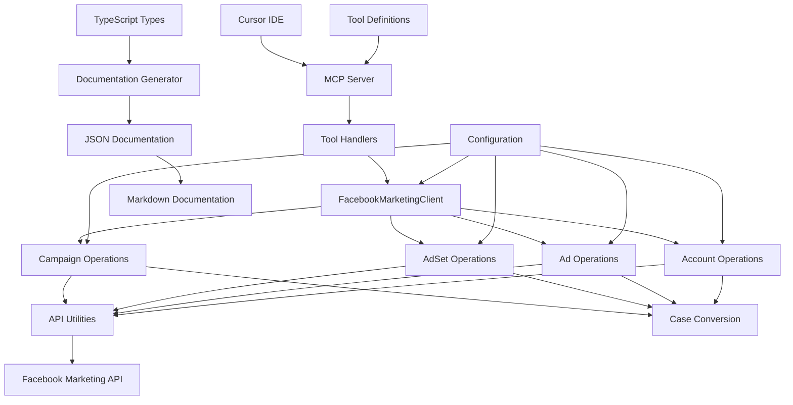

# Facebook Marketing MCP Server - System Patterns

## Architecture Overview
The system follows a modular architecture with clear separation of concerns:
1. **Graph API Integration Layer**: Handles direct Facebook Graph API communication
2. **MCP Interface**: Manages Cursor IDE integration
3. **Configuration Management**: Handles environment and credentials
4. **Operation Handlers**: Processes specific advertising operations
5. **Response Formatters**: Formats API responses for Cursor IDE
6. **Case Conversion Layer**: Manages camelCase to snake_case conversion for API compatibility
7. **Documentation Generation System**: Creates documentation from TypeScript types

## Key Technical Decisions
1. **TypeScript Implementation**: Ensures type safety and better development experience
2. **Modular Design**: Enables easy extension and maintenance
3. **Environment-based Configuration**: Supports different deployment scenarios
4. **Error Handling Strategy**: Comprehensive error management
5. **API Versioning**: Support for Facebook Graph API v22.0
6. **Direct API Integration**: Using native fetch for Facebook Graph API calls without SDK dependencies
7. **File Size Constraints**: Module files kept under 300 lines for maintainability
8. **Case Conversion Pattern**: Using humps library for reliable camelCase to snake_case conversion
9. **Type-Driven Documentation**: Generating documentation from TypeScript types

## Design Patterns
1. **Command Pattern**: For handling different advertising operations
2. **Factory Pattern**: For creating API client instances
3. **Singleton Pattern**: For configuration management
4. **Adapter Pattern**: For API response formatting
5. **Strategy Pattern**: For different operation implementations
6. **Facade Pattern**: Client class provides a simplified interface to the subsystems
7. **Transformer Pattern**: For converting between camelCase and snake_case in API interactions
8. **Generator Pattern**: For creating documentation from TypeScript types

## Code Organization
1. **src/utils/api.ts**: API request utilities and error handling
2. **src/utils/docgen.ts**: Documentation generation utilities
3. **src/operations/campaign.ts**: Campaign-specific operations
4. **src/operations/adset.ts**: Ad Set specific operations
5. **src/operations/ad.ts**: Ad specific operations
6. **src/operations/account.ts**: Account management operations
7. **src/client.ts**: Main client facade that delegates to operation modules
8. **src/config.ts**: Configuration and environment management
9. **src/tools/**: Tool schema definitions for MCP integration organized by entity type
10. **src/handlers.ts**: MCP request handlers implementation
11. **src/server.ts**: Slim main file that sets up and runs the MCP server
12. **src/scripts/generate-docs.ts**: JSON documentation generator
13. **src/scripts/generate-markdown-docs.ts**: Markdown documentation generator

## Component Relationships

## Data Flow
1. Cursor IDE sends MCP command
2. MCP Interface receives and validates command
3. Client delegates to appropriate Operation Handler
4. Case conversion transforms parameters from camelCase to snake_case
5. API Utilities make API call to Facebook
6. Response processed and returned to Client
7. Formatted response returned to Cursor IDE

## Documentation Generation Pattern
1. **Type-Driven Approach**: Documentation is generated directly from TypeScript types
2. **Two-Stage Process**:
   - First stage: TypeScript types to JSON schema
   - Second stage: JSON schema to readable Markdown
3. **Organization by Domain**: Tools are grouped by entity type (campaigns, ad sets, ads, accounts)
4. **Example Generation**: Automatic generation of example code snippets based on tool name and parameters
5. **Hierarchy**: Index file links to domain-specific documentation files
6. **Parameter Details**: Detailed documentation of each parameter including type, required status, and description
7. **Complex Object Documentation**: Nested documentation of complex parameter objects

## Case Conversion Pattern
1. **Consistent Interface**: Client accepts camelCase parameters (industry standard in JS/TS)
2. **Transformation Layer**: humps.decamelizeKeys() converts to snake_case for API
3. **Nested Object Handling**: Recursively transforms nested objects and arrays
4. **Documentation**: Clear documentation on expected format in file headers
5. **Type Safety**: Maintains TypeScript type safety through the conversion process

## Security Patterns
1. Environment-based credential management
2. Secure token handling
3. Input validation
4. Error message sanitization
5. Rate limiting implementation

## Error Handling Patterns
1. Structured error responses
2. Error categorization
3. Detailed error messages
4. Error logging
5. Graceful degradation
6. Centralized error handling in API utilities

## Testing Patterns
1. Unit testing for individual components
2. Integration testing for API interactions
3. Mock testing for Facebook API
4. End-to-end testing for MCP commands
5. Performance testing for API calls 