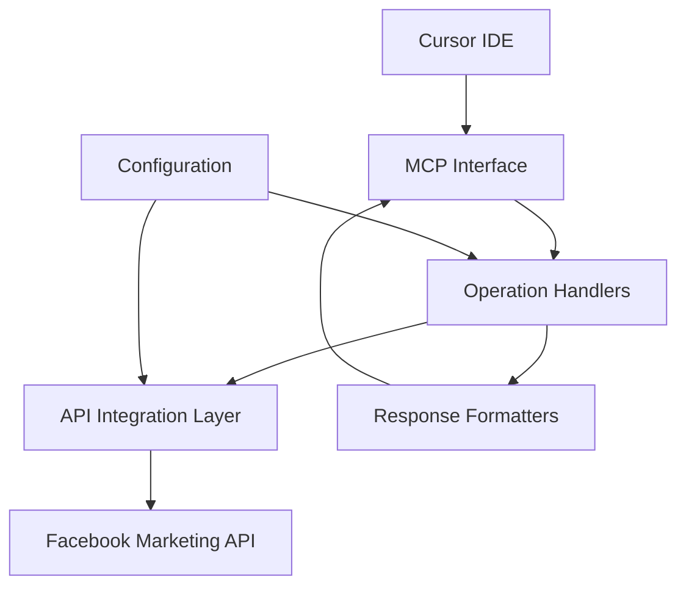

# Facebook Marketing MCP Server - System Patterns

## Architecture Overview
The system follows a modular architecture with clear separation of concerns:
1. **API Integration Layer**: Handles Facebook Marketing API communication
2. **MCP Interface**: Manages Cursor IDE integration
3. **Configuration Management**: Handles environment and credentials
4. **Operation Handlers**: Processes specific advertising operations
5. **Response Formatters**: Formats API responses for Cursor IDE

## Key Technical Decisions
1. **TypeScript Implementation**: Ensures type safety and better development experience
2. **Modular Design**: Enables easy extension and maintenance
3. **Environment-based Configuration**: Supports different deployment scenarios
4. **Error Handling Strategy**: Comprehensive error management
5. **API Versioning**: Support for Facebook Marketing API v18.0.0

## Design Patterns
1. **Command Pattern**: For handling different advertising operations
2. **Factory Pattern**: For creating API client instances
3. **Singleton Pattern**: For configuration management
4. **Adapter Pattern**: For API response formatting
5. **Strategy Pattern**: For different operation implementations

## Component Relationships

## Data Flow
1. Cursor IDE sends MCP command
2. MCP Interface receives and validates command
3. Operation Handler processes command
4. API Integration Layer makes API call
5. Response Formatter processes API response
6. Formatted response returned to Cursor IDE

## Security Patterns
1. Environment-based credential management
2. Secure token handling
3. Input validation
4. Error message sanitization
5. Rate limiting implementation

## Error Handling Patterns
1. Structured error responses
2. Error categorization
3. Detailed error messages
4. Error logging
5. Graceful degradation

## Testing Patterns
1. Unit testing for individual components
2. Integration testing for API interactions
3. Mock testing for Facebook API
4. End-to-end testing for MCP commands
5. Performance testing for API calls 